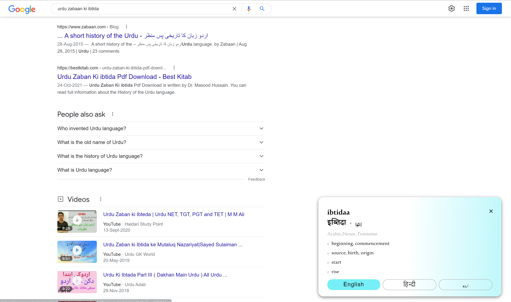
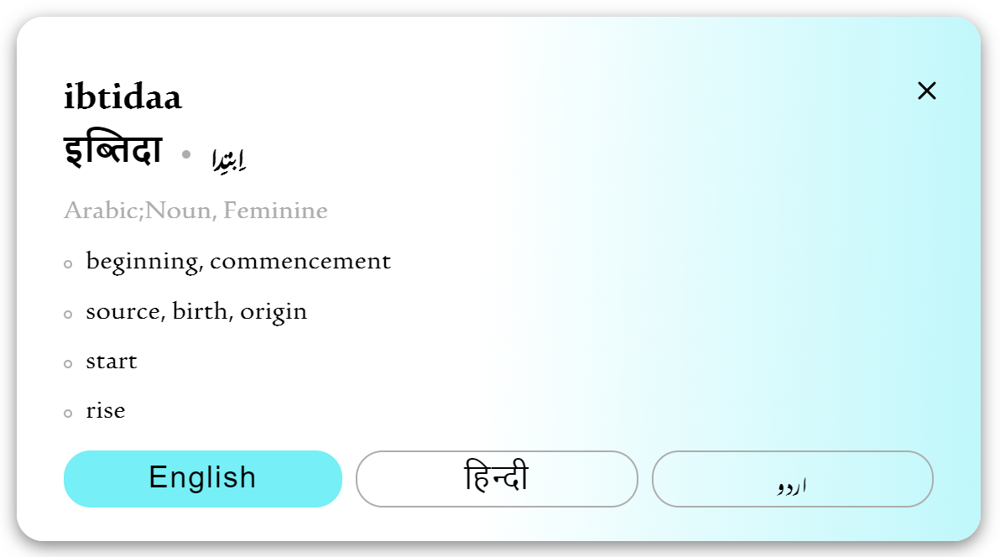
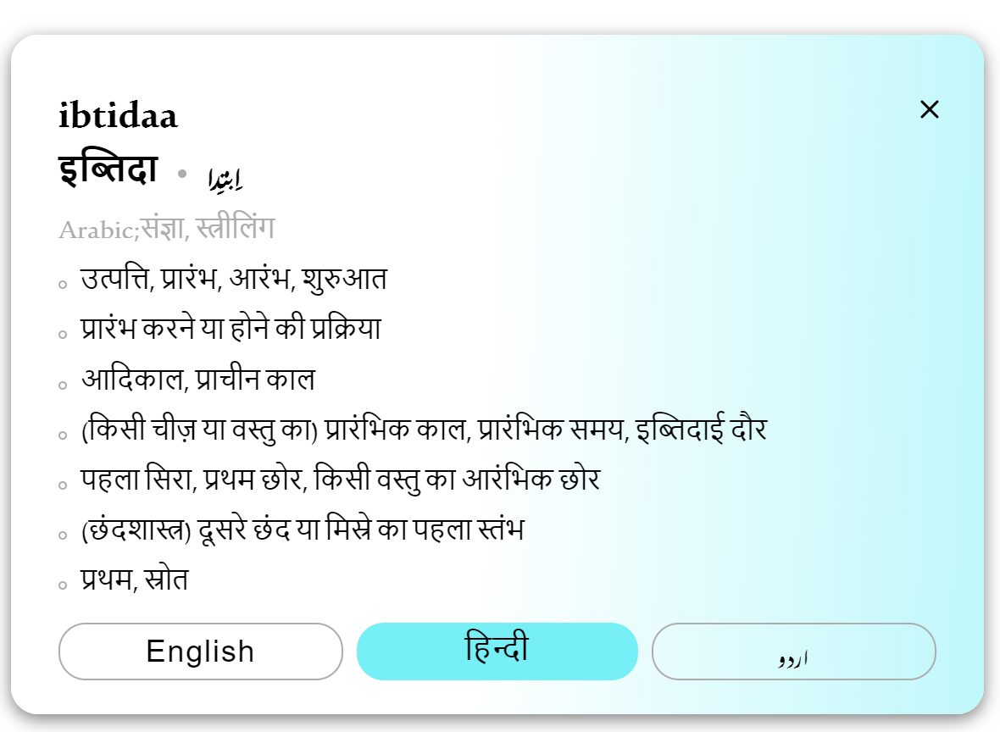
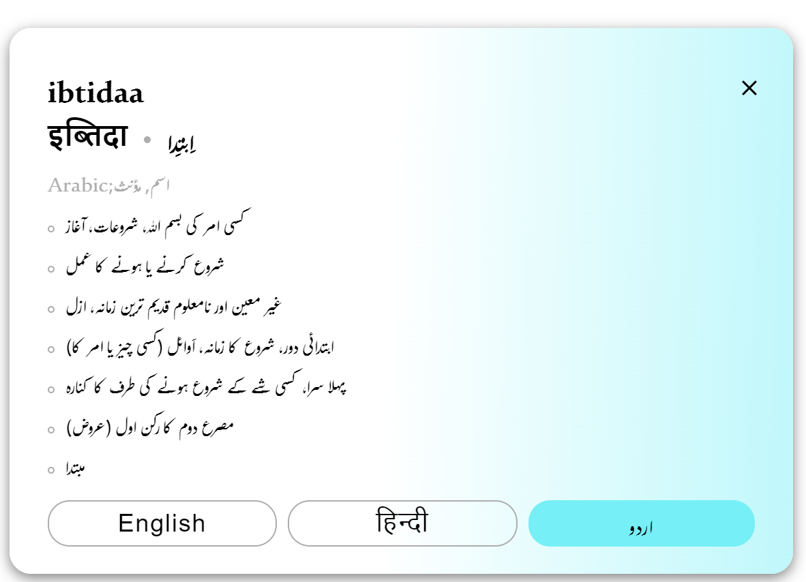
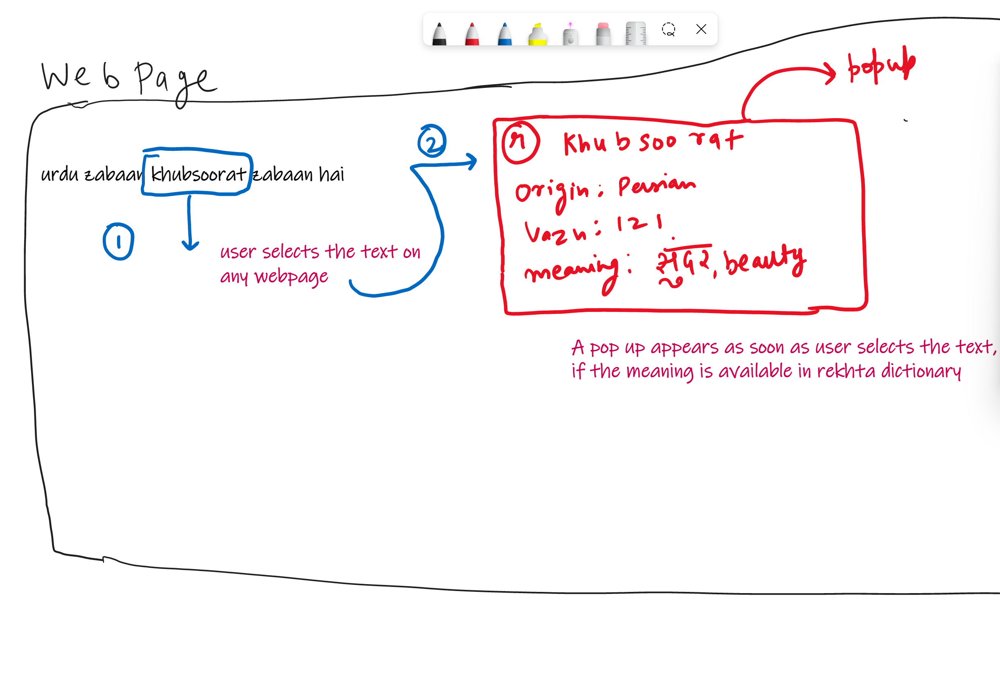
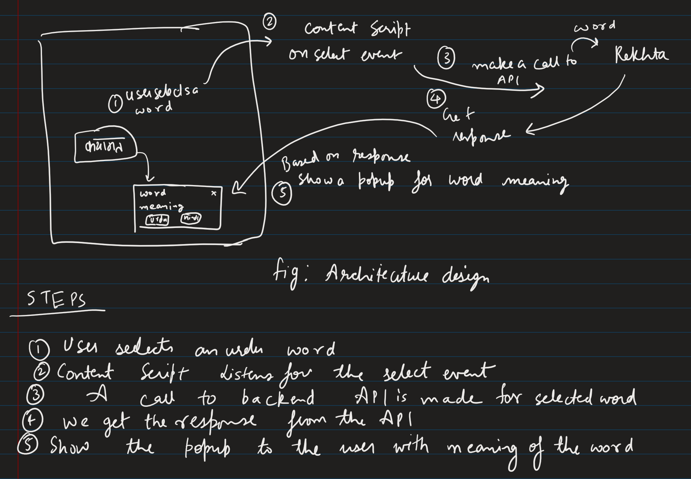

**रेख़्ता अब आपके और करीब..........**

Using Rekhta dictionary extension allows you to search meaning on the webpage itself. You don't have to go back to rekhta or rekhta dictionary website again and again to know the meaning. The good and best part it works anywhere on web. 

### Features supported:

- On the fly results
- Works anywhere on web
- Provide meaning in English, Hindi and Urdu
- Ease to use

Also it is very easy to use, let's see how:

Saket searches for the query "urdu zabaan ki ibtida" on google but alas he doesn't know the meaning of "ibtida", he selects the word and a suggestion pops up for him whether he wants to search the meaning from rekhta


And after clicking it he gets the meaning at the webpage itself, he is very happy now. 


Also the bottom popup allows him to know the meaning in Hindi, English and Urdu as well. 





# Dev docs

### Overall UX



### Architecture design



## For API
Code is written with .NET so you need to have Visual studio installed in order to run it. To open the code just run the .sln file from visual studio.

Backend API verification link:
https://rekhtadictionaryapi.azurewebsites.net/api/RekhtaDictionaryResponse?word=jabaan

## For Extension
### Installing and Running

#### Procedures:

1. Check if your [Node.js](https://nodejs.org/) version is >= **14**.
2. Run `npm install` to install the dependencies.
3. Run `npm start`
4. Load your extension on Chrome following:
   1. Access `chrome://extensions/`
   2. Check `Developer mode`
   3. Click on `Load unpacked extension`
   4. Select the `build` folder.
5. Happy hacking.

## Content Scripts

Although this boilerplate uses the webpack dev server, it's also prepared to write all your bundles files on the disk at every code change, so you can point, on your extension manifest, to your bundles that you want to use as [content scripts](https://developer.chrome.com/extensions/content_scripts), but you need to exclude these entry points from hot reloading [(why?)](https://github.com/samuelsimoes/chrome-extension-webpack-boilerplate/issues/4#issuecomment-261788690). To do so you need to expose which entry points are content scripts on the `webpack.config.js` using the `chromeExtensionBoilerplate -> notHotReload` config. Look the example below.

Let's say that you want use the `myContentScript` entry point as content script, so on your `webpack.config.js` you will configure the entry point and exclude it from hot reloading, like this:

```js
{
  …
  entry: {
    myContentScript: "./src/js/myContentScript.js"
  },
  chromeExtensionBoilerplate: {
    notHotReload: ["myContentScript"]
  }
  …
}
```

and on your `src/manifest.json`:

```json
{
  "content_scripts": [
    {
      "matches": ["https://www.google.com/*"],
      "js": ["myContentScript.bundle.js"]
    }
  ]
}
```

## Intelligent Code Completion

Thanks to [@hudidit](https://github.com/lxieyang/chrome-extension-boilerplate-react/issues/4)'s kind suggestions, this boilerplate supports chrome-specific intelligent code completion using [@types/chrome](https://www.npmjs.com/package/@types/chrome).

## Packing

After the development of your extension run the command

```
$ NODE_ENV=production npm run build
```

Now, the content of `build` folder will be the extension ready to be submitted to the Chrome Web Store. Just take a look at the [official guide](https://developer.chrome.com/webstore/publish) to more infos about publishing.

## Secrets

If you are developing an extension that talks with some API you probably are using different keys for testing and production. Is a good practice you not commit your secret keys and expose to anyone that have access to the repository.

To this task this boilerplate import the file `./secrets.<THE-NODE_ENV>.js` on your modules through the module named as `secrets`, so you can do things like this:

_./secrets.development.js_

```js
export default { key: '123' };
```

_./src/popup.js_

```js
import secrets from 'secrets';
ApiCall({ key: secrets.key });
```

:point_right: The files with name `secrets.*.js` already are ignored on the repository.

## Resources:

- [Webpack documentation](https://webpack.js.org/concepts/)
- [Chrome Extension documentation](https://developer.chrome.com/extensions/getstarted)